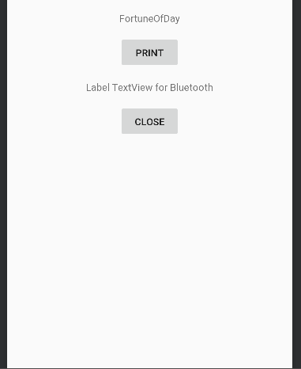

# Fortune-Printer

This is a fortune teller that tells you fortune and prints it on a receipt paper so you can keep it in your wallet and ponder your fate while you commute to Redmond (or from Redmond to DT).

## Setup

* Open this in android studio
* Run

## Screen Shots
 
 
    
 

## Sources that I've learnedfrom from

* This is a actually a really good tutorial
  * https://www.androidcode.ninja/android-bluetooth-tutorial/

* This is what was shipped with the printer:
  * https://github.com/suddin0/pos-5890t/tree/35e34e51450c6d91940bd3fa65539db9915940d9/SDK/Android%20SDK/BlueToothDEMO

* The printer I bought from amazon: 
  * https://www.amazon.com/Thermal-Receipt-MUNBYN-Compatible-Business/dp/B0753B5KYG/ref=sr_1_4?crid=146X1JQQRB48R&keywords=munbyn&qid=1554498030&s=gateway&sprefix=munby%2Caps%2C181&sr=8-4

 

